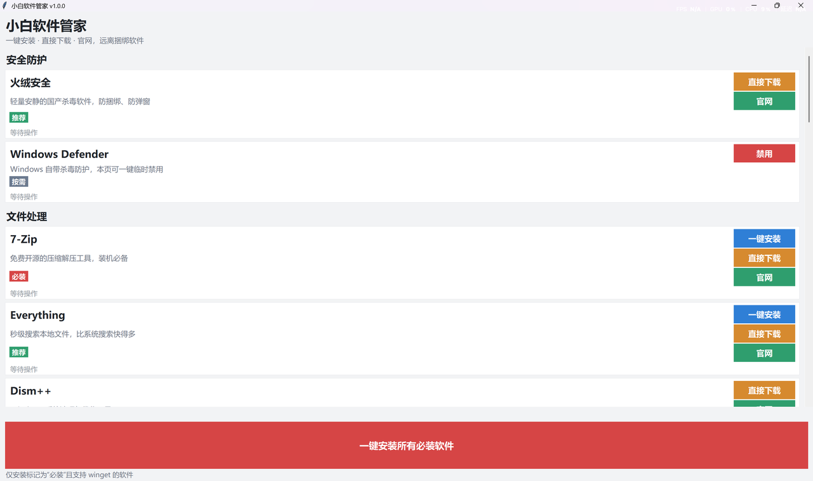

# 小白软件管家

面向 Windows 10 / 11 电脑新手的图形化软件安装工具。全程**无命令行黑窗口**，大字体、大按钮，按分类一键安装、直接下载或跳转官网，帮你避开捆绑软件。

## 界面预览



## 下载

**无需安装 Python**：到 [Releases](https://github.com/Mosen50/XiaoBai-Software-Manager/releases) 页面下载 `小白软件管家.exe`，双击即可运行。

## 核心优势：零第三方依赖

本程序**只使用 Python 自带的 `tkinter` 标准库**，不需要 `pip install` 任何东西，也不需要联网装插件。只要电脑上装了**官方版 Python**（从 python.org 下载的安装包默认自带 tkinter），双击即可运行。

> 如果连 Python 都不想装，请直接看下面的「打包成 exe」——打包后的 exe 在任何干净电脑上双击即用，什么都不用装。

## 功能一览

- 图形化主窗口，可滚动，大字体、大按钮，界面友好
- 软件按 10 大类展示：安全防护、文件处理、办公套件、浏览器、影音播放、社交通讯、效率工具、系统工具、游戏平台、游戏加速器
- 每个软件条目包含：名称、一句话说明、标签（必装 / 推荐 / 按需）、操作按钮、状态文字
- 每个软件按“有没有”动态显示操作按钮：
  - **一键安装**（有 winget 包 ID 时）—— 静默后台安装
  - **直接下载**（有直接下载地址，或可用 winget 下载时）—— 下载安装包到“下载”文件夹，带进度，完成后询问是否立即运行
  - **官网**（有官网地址时）—— 默认浏览器打开官网
  - Windows Defender → **禁用**（二次确认后以管理员权限禁用实时保护）
  - 驱动检测 → **检测驱动**（扫描缺失/异常驱动）、**Windows 更新**（系统自带驱动更新）、**驱动工具官网**
  - Geek Uninstaller → 小巧免费的卸载工具，一键安装 / 直接下载 / 官网
- 启动时自动检测 winget：
  - 可用 → 正常显示所有“一键安装”按钮
  - 不可用 → 顶部红色警告 + **一键安装 winget** 按钮
- 底部固定 **一键安装所有必装软件** 大按钮
- 细节优化：鼠标滚轮**全局平滑滚动**、按钮**悬停变色动画**、下载**实时百分比进度**
- 所有 subprocess 调用均隐藏控制台窗口，安装/下载过程后台进行
- 不显示任何网址文本，网址仅用于按钮跳转或代码内部下载
- Windows Defender 禁用需二次确认并提示风险，不纳入“一键必装”

## 内置软件

- 安全防护：火绒安全、Windows Defender（禁用）
- 文件处理：7-Zip、Everything、Dism++
- 办公套件：WPS Office、LibreOffice
- 浏览器：Microsoft Edge、Google Chrome
- 影音播放：PotPlayer
- 社交通讯：微信、QQ
- 效率工具：Snipaste、QuickLook
- 系统工具：Geek Uninstaller、驱动检测
- 游戏平台：Steam、Epic Games、WeGame、暴雪战网、EA App、Ubisoft Connect
- 游戏加速器：网易UU、迅游、奇游

## 使用方法

1. 双击运行（exe 版无需安装任何东西）
2. 找到想要的软件，点击按钮：**一键安装**（自动静默安装，推荐）/ **直接下载**（只下安装包）/ **官网**（跳转官网）
3. 想一次装齐，点底部 **一键安装所有必装软件**
4. 驱动异常？点「系统工具」里的 **检测驱动**

## 环境要求

- Windows 10（较新版本）或 Windows 11
- Python 3.8 及以上（官方安装包自带 tkinter，无需额外安装任何库）
- 能联网（下载 winget 安装包、调用 winget、直接下载安装包都需要网络）

## 运行

推荐用 `pythonw.exe` 启动（**完全没有控制台窗口**）：

```bash
pythonw main.py
```

也可以直接双击 `main.py`，或用 `python main.py` 运行（后者会短暂出现一个控制台窗口，但程序内部不会再弹出黑框）。

## 打包成 exe（推荐给小白用）

打包成单个、无控制台窗口的 exe，之后在任何干净电脑上双击即用，**连 Python 都不用装**：

```bash
pip install pyinstaller
pyinstaller --onefile --windowed --name "小白软件管家" main.py
```

打包完成后，exe 位于 `dist\小白软件管家.exe`，可直接双击运行或发给别人。

> 提示：若打包后被杀毒软件误报，可添加信任，或改用 `--onedir` 方式打包减少误报概率。

## 常见问题

**Q：提示“未检测到 winget”？**
点击顶部横幅上的“一键安装 winget”，程序会自动下载并安装 App Installer。若安装失败，请检查网络，或把 Windows 更新到较新版本。

**Q：“直接下载”后安装包在哪？**
默认下载到「此电脑 → 下载」文件夹；走 winget 下载的会放在「下载 → 小白软件管家」子文件夹里。下载完成后程序会弹窗询问是否立即运行。

**Q：某个“直接下载”地址失效了怎么办？**
程序下载失败会自动提示，你可以改用“官网”按钮。个别“最新版直链”可能随时间变化，遇到失效告诉我即可更新。

**Q：点了“禁用”Windows Defender 没反应？**
Windows 的“篡改防护”开启时会拦截该命令。请先到「Windows 安全中心 → 病毒和威胁防护 → 病毒和威胁防护设置 → 管理设置」关闭“篡改防护”，再回来禁用。**建议用完尽快重新开启实时保护。**

**Q：安装时弹出 UAC（用户账户控制）窗口正常吗？**
正常。部分软件需要管理员权限，这是 Windows 的安全确认弹窗，不是命令行窗口，点“是”即可。

**Q：“检测驱动”报告有异常怎么办？**
先点“Windows 更新”让系统自动装驱动；若仍缺失，再用“驱动工具官网”里的 Snappy Driver Installer Origin（开源、无捆绑）补充。Geek Uninstaller 是卸载工具，用于彻底卸载软件、清理残留。

## 软件列表维护

所有软件都定义在 `main.py` 顶部的 `SOFTWARE` 列表中，字段清晰：

```python
{"name": "软件名", "desc": "一句话说明", "tag": "必装/推荐/按需",
 "category": "分类", "winget": "包ID 或 None",
 "url": "官网地址 或 None", "download_url": "直接下载地址 或 None"}
```

- 有 `winget` → 显示“一键安装”；无 `download_url` 时“直接下载”也会用 winget 下载
- 有 `download_url` → “直接下载”用该直链下载（无需 winget）
- 有 `url` → 显示“官网”按钮

增删软件只需修改该列表，无需改动界面代码。winget 包 ID 可用 `winget search 软件名` 验证。

## 免责声明

本工具仅调用系统自带 winget、跳转官网或下载官方直链，不内置、不捆绑任何第三方安装包。禁用 Windows Defender 会降低系统安全性，请谨慎使用并自行承担风险。
